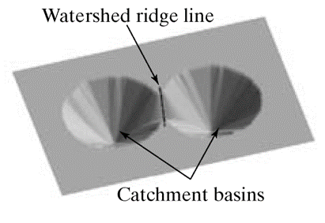

## Introduction

Each pixel on the image was categozied as one of three type:

- regional minimum: the bottom of the cone.
- catchment basin: the region from the bottom of the cone to `watershed line`
- watershed lines: the border of `catchment basin`

The algorithm will find these points.

## How it works

1. Find `regional minimum`
2. From `regional minimum`, pull the water into `catchment basin`
3. Keeping to pull water into `catchment basin` until `catchment basin` overlap. This is `watershed lines` point.

## Reference

- [cecas.clemson.edu ece847 lecture04-segmentation.ppt](https://cecas.clemson.edu/~stb/ece847/internal/lectures/lecture04-segmentation.ppt)
- [tau.ac.il turkel watershed_Segmentation.ppt](http://www.math.tau.ac.il/~turkel/notes/watershed_Segmentation.ppt)
