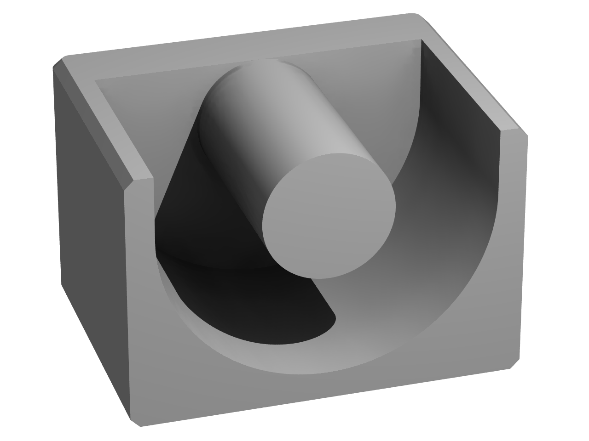
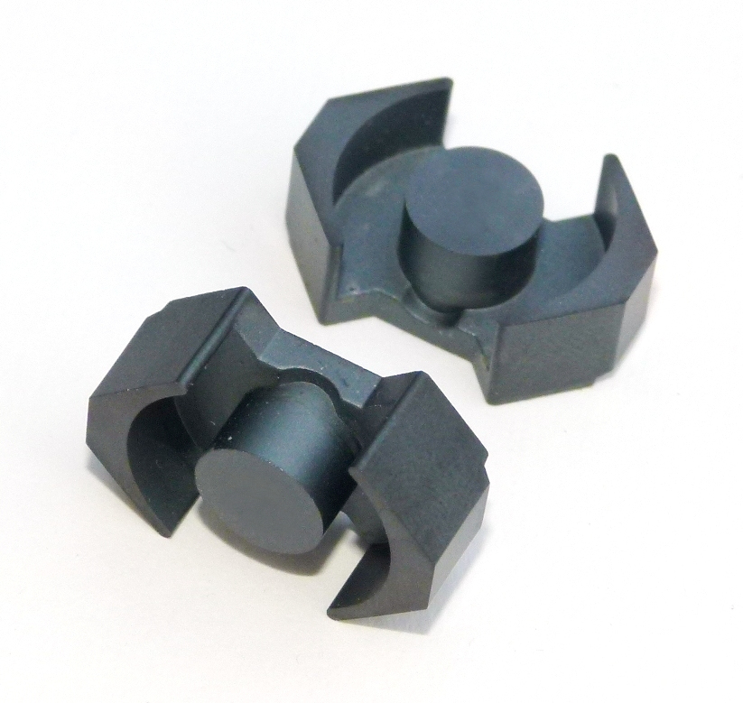

| Ferrite Power Materials Summary                         |       | F     | P     | R     | J                       | W+     |
| ------------------------------------------------------- | ----- | ----- | ----- | ----- | ----------------------- | ------ |
| µi (20 gauss)                                           | 25˚C  | 3,000 | 2,500 | 2,300 | 5,000                   | 10,000 |
| µp (2000 gauss)                                         | 100˚C | 4,600 | 6,500 | 6,500 | 5,500                   | 12,000 |
| Saturation Flux Density ($B_{max}$ Gauss)               | 25˚C  | 4,900 | 5,000 | 5,000 | 4,300                   | 4,300  |
|                                                         | 100˚C | 3,700 | 3,900 | 3,700 | 2,500                   | 2,500  |
| Core Loss (mw/cm3) (Typical) @100 kHz, 1000 Gauss | 25˚C  | 100   | 125   | 140   | low-level power transf. |        |
|                                                         | 60˚C  | 180   | 80\*  | 100   |                         |        |
|                                                         | 100˚C | 225   | 125   | 70    |                         |        |

Core Geometries

| Core Geometries |                                                       | Core Geometries |                                                       |
| --------------- | ----------------------------------------------------- | --------------- | ----------------------------------------------------- |
| Classical E     |     | ETD             |  |
| EFD             |  | EP              |    |
| Pot core        |  | RM core         |    |
| PQ core         |    | PM core         |    |

## Core selection


$$
A_p = A_E A_W = \frac{P_{out}}{K_c K_t B_{max} F_{SW} J} 10^4
$$


- $A_P$: product of window area and core area, $cm^2$
- $A_E$: effective cross section of the core, $cm^2$
- $A_W$: window area (or winding area), $cm^2$
- At: surface area of the transformer


$$
\begin{align*}
& A_e = 20 \times 27.4 = 540 \; mm^2 \\
& A_W \text{ (often referred in datasheets as )} A_N = 4.35 \; cm^2\\
& A_P = A_E × A_W = 5.4 \times 3.24 = 5.4 × 4.35 = 23.5 \; cm^4
\end{align*}

$$


References

- https://en.wikipedia.org/wiki/Magnetic_core
- https://e-magnetica.pl/list_of_ferrite_core_types
- [Transistor](https://electronics.stackexchange.com/users/73158/transistor), SMPS Transformer Area of Product, URL (version: 2020-06-11): https://electronics.stackexchange.com/q/504104
