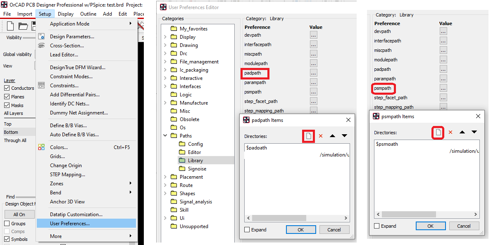

## Orcard error list

1. [ORCAP-1605](https://youtu.be/6QexV1B6tus)
   1. Two references have same name in different schematic.

## Footprint

`C:\Cadence\SPB_17.4\share\pcb\pcb_lib\symbols`

Within this folder, you can double-click on the `.dra` files to see footprints and the `.pad` files to see padstacks in PCB Editor.

SnapEDA, UltraLibrarian or Samacsys or use Place - Search Providers from within OrCAD Capture

## References

- [OrCAD/Allegro V17.2-2016 footprints](https://www.cb-distribution.nl/news/172_footprints/)
  - [parallel-systems.co.uk](https://www.parallel-systems.co.uk/wp-content/uploads/2020/02/SPB172_Footprints-Parsys.pdf)
    - Backup [file](SPB172_Footprints-Parsys.pdf)
  - [orcad.co.uk](http://orcad.co.uk/images/PDF/SPB172_Footprints.pdf)
- [Finding existing PCB footprints for Cadence PCB Editor](http://esdresources.blogspot.com/2017/02/finding-existing-pcb-footprints-for.html?m=1)
