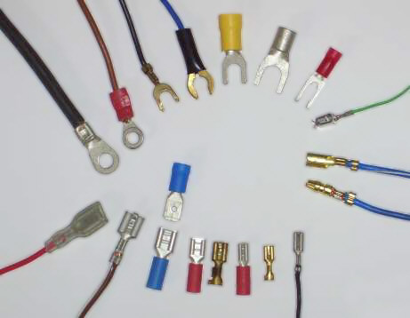
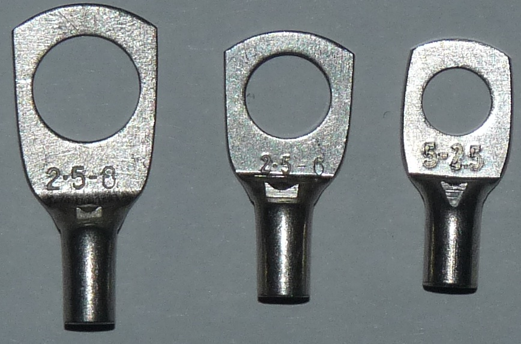
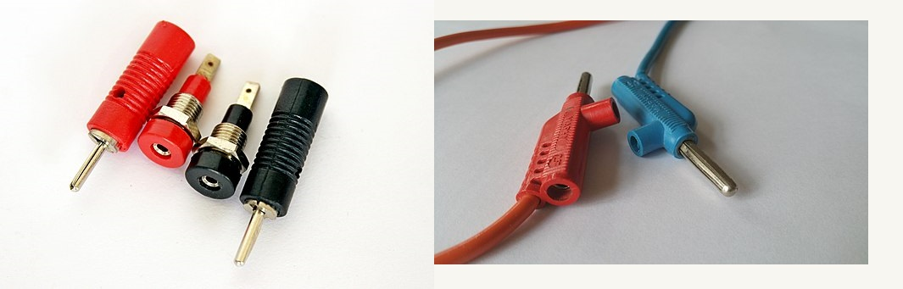
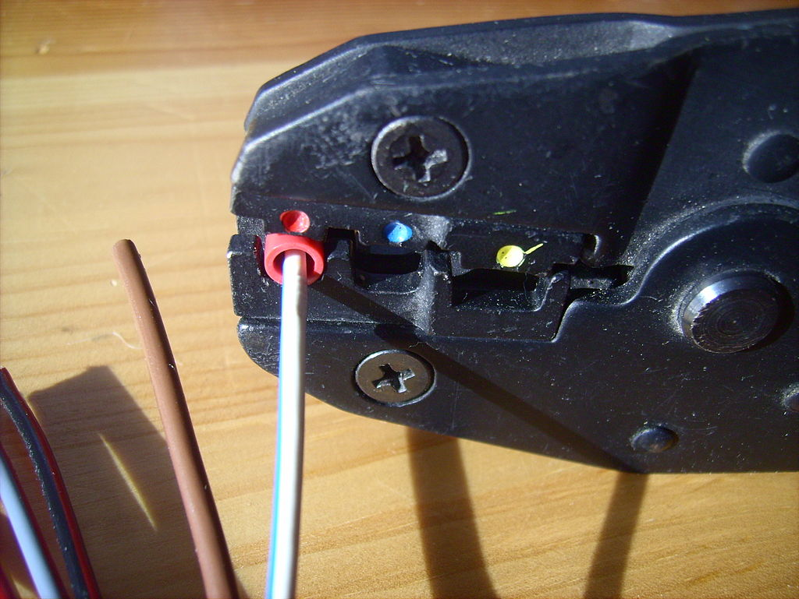

## Connector

Blade connectors (lower half of photo). Ring and spade terminals (upper half). Bullet terminals, male and female (right-center, with blue wires)

|  |
| :---------------------------------------------: |
|                 Blade connector                 |

|  |
| :-----------------------------------------------------: |
|     Split-ring or lugs terminals for 2.5 mm² wire.      |

|  |
| :---------------------------------------------------------: |
|                    Banana jack connector                    |

Using crimping tool to join wire to the connector.

|  |
| :----------------------------------------: |
|               Crimping tool                |
