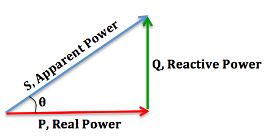

Table of contents

- [Connector](#connector)
- [Power factor](#power-factor)
- [Interfacing Matlab Simulink with Plexim PLECS](#interfacing-matlab-simulink-with-plexim-plecs)
- [Potentiometers](#potentiometers)

## Connector

Blade connectors (lower half of photo). Ring and spade terminals (upper half). Bullet terminals, male and female (right-center, with blue wires)

|  |
| :---------------------------------------------: |
|                 Blade connector                 |

|  |
| :-----------------------------------------------------: |
|     Split-ring or lugs terminals for 2.5 mm² wire.      |

|  |
| :---------------------------------------------------------: |
|                    Banana jack connector                    |

Using crimping tool to join wire to the connector.

|  |
| :----------------------------------------: |
|               Crimping tool                |

## Power factor

|  |
| :----------------------------------------------------------: |
|        Apparent power, reactive power and real power         |

The picture shows the relationship between "Apparent Power", "Reactive Power" and "Real Power".

- Reactive power is an AC power flow through the operation of the inductors and capacitors. This kind of power doesn't contribute to the

See more at [What is the role of reactive power in transmission networks?](https://www.reddit.com/r/askscience/comments/90q7i7/comment/e2sc27o/?utm_source=share&utm_medium=web2x&context=3)

## Interfacing Matlab Simulink with Plexim PLECS



## Potentiometers

[P16NP504KAB15 Vishay / Sfernice | Mouser Denmark](https://www.mouser.dk/ProductDetail/Vishay-Sfernice/P16NP504KAB15?qs=sGAEpiMZZMtC25l1F4XBU4GDvGXyUw%2BkUqAGoVe0N3c%3D)

There's a *LOT* of files on the official LTwiki.

For potentiometers look in ([source](https://www.eevblog.com/forum/eda/is-there-an-updated-massive-open-source-style-library-for-ltspice/)):

- http://ltwiki.org/files/LTspiceIV/lib/sym/Pot&Sw/ for the symbols, and
- http://ltwiki.org/files/LTspiceIV/lib/sub/Pote.lib is the associated library, (including both potentiometer_standard.lib and potentiometer_tapped.lib with documentation and sample files at
- http://ltwiki.org/files/LTspiceIV/examples/LtSpicePlus/Discretos/Sw&Pote/
